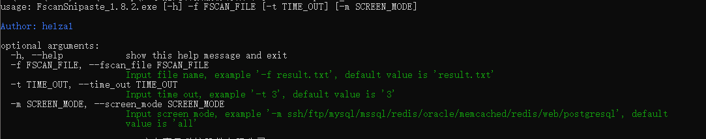

# FscanSnipaste

## 初衷

1、攻防时内网fs大保健后，一大堆打印机、FTP等，重复截图效率太低

2、蓝队应急快、动不动拔网线，人工截图速度慢

## 使用

> FscanSnipaste_1.8.2 -h



本地靶场环境使用截图：

> FscanSnipaste_1.8.2.exe -f 172.168.txt -m all -t 3


**默认：**

example:

> FscanSnipaste -f result.txt

所有模块都会连接，超时时间为3s

单选项截图，例如：

```下述测试均为本地虚拟机环境```

**ftp**

> FscanSnipaste -f result.txt -m ftp -t 5


**mysql**

> FscanSnipaste -f result.txt -m mysql -t 5


**redis**

> FscanSnipaste -f result.txt -m redis


**postgres**

> FscanSnipaste -f result.txt -m postgres


**web**

> FscanSnipaste -f result.txt -m web

只会批量打开url，不会打poc


## 下载


## 问题

1、Oracle连接不上，存在客户端和服务端版本不一致的问题

2、web模块不能适配POC，只能批量打开infoscan的url，没有"/druid/index.html"这些POC拼接进去

3、只适配fs1.8.2，1.8.3输出的格式不一样了

